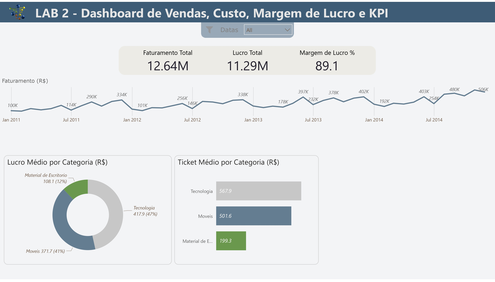

## 📊 LAB 2 - Dashboard de Vendas, Custo, Margem de Lucro e KPI

🔎 Estudos iniciais das formulas basicas e teste de paletas de cores. 

---

## 🧠 Objetivo

Visando padronizar meus relatorios e trazer um aspecto de seriedade sem muita distraçao visual, testei algumas combinaçoes nesse relatorio simples.

---

## 🗂️ Fonte de Dados

- Arquivos CSV públicos fornecidos pelo curso da DSA (Data Science Academy)

---

## 🛠️ Ferramentas Utilizadas

- Microsoft Power BI
- Power Query (ETL)
- DAX (cálculos e KPIs)
- Excel (apoio na preparação dos dados)

---

## 📈 Cores utilizadas no visual
**Uso sugerido - Hex - Comentário** 
Indicador positivo - #6A994E - Transmite crescimento com sobriedade. 
Indicador negativo - #BC4749 - Forte e profissional, sem exageros visuais. 
Indicador neutro - #A1A1A1 - Ideal para representar estabilidade ou valores nulos. 
Fundo principal - #F2F2F2 - Ótimo para manter contraste com os dados sem pesar visualmente. 
Destaque (títulos ou barras) - #3E5C76 - Sofisticado, ótimo para cabeçalhos e títulos. 
Cor secundária de dados - #4C5B47 - Pode ser usada em gráficos de colunas ou linhas. 
Fundo alternativo - #E6E1D3 - Cria separação de seções ou painéis mantendo elegância. 
Texto ou bordas sutis - #2F2F2F - Legível em qualquer fundo claro, ótimo para rótulos.

---
## 📸 Capturas de Tela

---
## 🔗 [Lab2_Dashboard](https://bit.ly/3FpIJ15)
